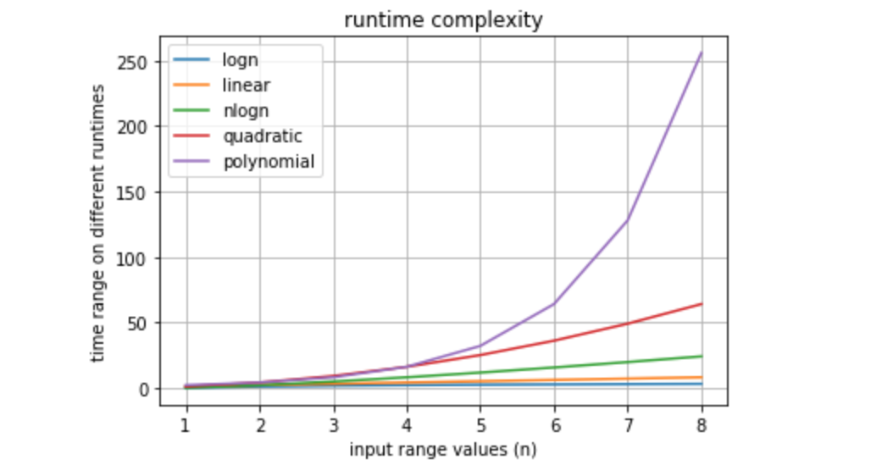

# algorithms

Questions to common interview algorithms or problems asked.

## guidelines

Comment the code as much as necessary, but better try to write code that has lower noise and easy to understand so others can find it useful and learning.

### difference between concurrency and parallelism
 
break the problem down into individual components which can be done 

### Plotting of different runtimes

[Python Gist](https://gist.github.com/pranavgarg/58744db65aed50f0dbe7f99217228ffa) to see it in action
 
 